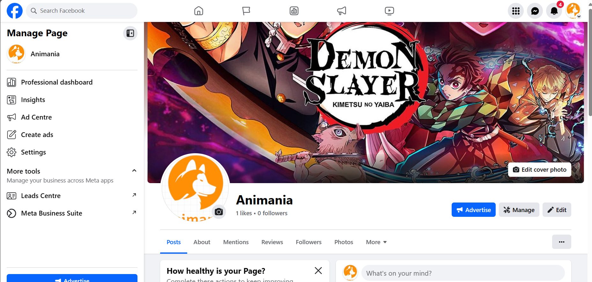
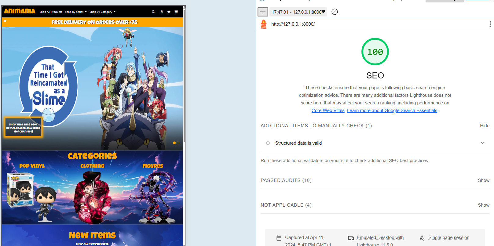

# Animania

## Animania Anime merchandise

Animania is an e-commerce merchandise store, the core behind animania is that it offers anime merchandise all in one place for anime lovers to buy. I decided to go for this particular genre as I know several anime fans, myself included and the market for being able to purchase and browse a selection of merchandise from different anime is quite scarce and difficult to find.

Even though this site is fictional and the products shown in this site are not available I do believe that there is a potential in the market for a store like this one, that could have little competition when browsing and purchasing goods for anime.

This project was created for the portfolio project 5 - with code institute

## Live deployment 

This project is deployed on Heroku 
the link for which is here: [live deployment](https://animania-175b65d61606.herokuapp.com/)

## Contents
- [Testing](#testing)
- [Bugs](#bugs)
- [Credits](#credits)
- [Project_outline](#project-outline)
    - [Purpose](#purpose)
    - [User_goals](#user-goals)
    - [Site_manager_goals](#site-manager-goals)
    - [Business_model](#business-model)
        - [Marketing_strategies](#marketing-strategies)
        - [SEO](#search-engine-optimisation)

## Project outline 

### Purpose
The purpose of this website is to get users and site owners excited about buying or selling anime merchandise, using colourful visuals and an intuitive layout, I have tried to design this site as seamlessly as I can using html, css, javascript, python and the django framework.

### User goals 
The goals for a user are simple, easy navigation to products for quick impulse or well thought out purchases, they should be able to navigate to whichever product they wish to buy and easily be able to purchase it!

### Site manager goals
Full control over quantity, price, costprice, product statuses such as new or discounted products, which banners to display on the front page for promotional pushing. Ability to track the turnover and profit returned from the online store via the profile.
To give users a feeling of satisfaction when shopping the site so that repeat custom is almost guaranteed.

### Business Model 
 - The core of animania is a B2C (business to consumer), we want to invoke an emotional response with the user that really gives them that feeling of a good shopping experience, in turn driving repeat visitation and marketing by word of mouth.
 The core point of animania is to sell anime related goods to an end-point user giving transparancy of costs along the way, and relevant guidance in purchasing where necessary, We consider the impulse purchases and the considered purchases and implement a style that hopefully has something for everyone.

#### Marketing Strategies
 - Competetion tracking is essential when it comes to merchandise and the only main competitor I could find on the market was Atsuko, that offered a similar style of merchandising the way Animania would.
 - Trending series is essential when deciding on products to sell with animania and market research to keep up to date with new series and new season releases should be shown in the news page for users to get to grasps with upcoming and trending animes
 - The page highlights sale products and also emphasises what products are new to the store potentially driving an impulse purchase with the customer
 - Changes to products can be amended swiftly, changes to banners can be adjusted swiftly giving the user a more dynamic approach and hopefully they see something new when they do decide to revisit the store.
 - Customer engagement and feedback is also imperative when it comes to marketing and a new user is much more likely to purchase from the site if the level of positive feedback is high, this is shown in the all products page as an average review score, and all reviews are displayed within the product detail page to let customers persuade other customers about the quality.
 - Animania is responsive on all devices allowing users to be able to shop on a multitude of devices. according to google 
 'Nearly three-quarters of British shoppers prefer mobile devices when making online purchases, with 48% of them using their phones for purchases at least once a week.' - 
 [dontdisappoint](dontdisappoint.me.uk/resources/finance/mobile-commerce-statistics-uk/)
 - Social media presence is a huge factor in todays success of a business, sometimes though it is difficult to filter through the authenticity of a business. Animania uses a facebook page as a source of marketing
 
 
#### Search engine optimisation
SEO (search engine optimisation) - Important for authenticity of a website, important for ranking in a search engines search queries, the higher you score the more likely it is that your site is going to be shopped and viewed by customers. 
Ways to increase SEO
- Meta description: "Discover a wide range of anime merchandise including apparel, figures, accessories, and more at our online store. Shop now for the latest anime products!
- Meta keywords: "animania, anime merchandise, anime store, anime apparel, anime figures, anime accessories, anime merch, pop-vinyl, clothing, sale-items"
- Inclusions
    - Inclusion of a robots.txt file: As I am aware this only improves performance based on the site being a custom domain that needs card details.
    - Inclusion of a sitemap.xml file.
- Suitable rel tags for external links: the tags used in this project are noopeners as they do not have direct content linked to animania, they are standalone webpages that do not need to be crawled to learn about the animania site. 
- Lighthouse SEO score

## Testing
The manual testing performed for animania is all document below:
[Animania-testing](TESTING.md)

## Bugs 
- Unfixed bugs
    - No bugs left unfixed within the website as far as the testing is concerened, features all seem to behave as expected.

- Fixed bugs 
    - Issue rendering the dynamic links in the navbar when a filter was in, this was due to a conflict in variable names in the context processor for the site and the variable in the view for the all products page.
    
    - Issue with button on the banner image on index.html not submitting a filter query when pressed, button was not inside a form and therefore had nowehere to navigate too.

    - Footer wasn't generating the extra text when clicking the 'readmore...' drilled into it further with the script and adjusted the code to remove syntax errors. 

    - Amend products table wasn't showing the boolean results of if a product was 'new', fixed by amending the if statement i had used to get the correct results.

    - Couldn't upload a banner for attack on titan this was due to two seperate values of Attack on Titan being available in series choices representing two different values

    - Sizes were being delete when updating quantities in the shopping bag, fixed by adding a name to the size hidden input form in basket.html

    - search bar was disappearing from base.html on click, made the search function only available in all products as it seemed more logical for it to live in there

    - 404 returned when non-users tried to submit a review, fixed by using an if statement to only display leaving a review if you are logged in. 

    - 404 on submitting a new product, fixed by assigning making sure the order number after generation was being passed back into itself. 

    - Calculations for delivery were not being recognised, had some wrong variable names in the model that were causing the issue of not calculating properly.

    - Bug where the size was not being processed in the checkout, changed the way that size was being fetched in the context processor and made sure that the size was correctly matching the values specified in the Size model.

    - Used a wrong variable in the model that was causing the order total, grand total and delivery not to to update in the admin for new orders. 

    - bug where only the first product was allowed to have a size, amended the view for new products and removed the init method of the form to make sure that it now works correctly, added extra validation in the view to prevent mulitple sizes being submitted.

    - bug where a non size item was being prevented from being added to the basket fixed by adding the a variable for the product in the add to basket app so that it could correctly calculate a validation for the quantity available and not let a user buy more than available

    - 500 error code returning for 404, the issue was I missed a path name in urls.py on products so when a user typed in http://127.0.0.1:8000/b for example it was looking for a product and not a faulty url returning the 500 code and not the 404.

## Credits 

- Code for adding products to the basket was taken from the boutique-ado walkthrough project.
- Used the project boutique-ado walkthrough for the creating order, order-lines code.