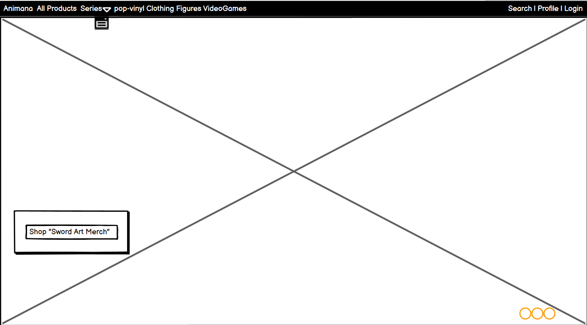
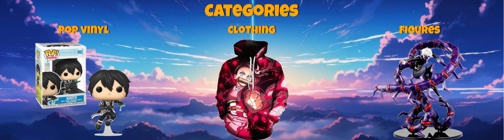

# Animania

## Animania Anime merchandise

Animania is an e-commerce merchandise store, the core behind animania is that it offers anime merchandise all in one place for anime lovers to buy. I decided to go for this particular genre as I know several anime fans, myself included and the market for being able to purchase and browse a selection of merchandise from different anime is quite scarce and difficult to find.

Even though this site is fictional and the products shown in this site are not available I do believe that there is a potential in the market for a store like this one, that could have little competition when browsing and purchasing goods for anime.

This project was created for the portfolio project 5 - with code institute

## Live deployment 

This project is deployed on Heroku 
the link for which is here: [live deployment](https://animania-175b65d61606.herokuapp.com/)

## Contents
- [Project outline](#project-outline)
    - [Purpose](#purpose)
    - [User goals](#user-goals)
    - [Site manager goals](#site-manager-goals)
    - [Business model](#business-model)
        - [Marketing strategies](#marketing-strategies)
        - [SEO](#search-engine-optimisation)
- [Agile method](#agile-method-for-project-management)
- [Database Models](#database-models)
    - [Models](#models)
    - [Relationships](#relationships)
- [UX](#ux-user-experience)
    - [Wireframes](#wireframes)
    - [User Stories](#user-stories)
    - [Site Perspective](#site-perspectives)
    - [Design choices](#design-choices)
    - [Features](#features)
        - [Home](#homepage)
        - [Profile](#profile)
        - [Amend Products](#amend-products)
        - [All products](#all-products)
        - [Product-detail](#product-detail)
        - [basket](#checkout-basket)
        - [checkout](#checkout-features)
        - [Checkout success](#checkout-success)
        - [News](#news-features)
        - [News detail](#news-detail-page)
        - [Forms](#forms)
    - [Future features](#future-features)
- [Testing](#testing)
- [Bugs](#bugs)
- [Credits](#credits)

## Project outline 

### Purpose
The purpose of this website is to get users and site owners excited about buying or selling anime merchandise, using colourful visuals and an intuitive layout, I have tried to design this site as seamlessly as I can using html, css, javascript, python and the django framework.

### User goals 
The goals for a user are simple, easy navigation to products for quick impulse or well thought out purchases, they should be able to navigate to whichever product they wish to buy and easily be able to purchase it!

### Site manager goals
Full control over quantity, price, costprice, product statuses such as new or discounted products, which banners to display on the front page for promotional pushing. Ability to track the turnover and profit returned from the online store via the profile.
To give users a feeling of satisfaction when shopping the site so that repeat custom is almost guaranteed.

### Business Model 
 - The core of animania is a B2C (business to consumer), we want to invoke an emotional response with the user that really gives them that feeling of a good shopping experience, in turn driving repeat visitation and marketing by word of mouth.
 The core point of animania is to sell anime related goods to an end-point user giving transparancy of costs along the way, and relevant guidance in purchasing where necessary, We consider the impulse purchases and the considered purchases and implement a style that hopefully has something for everyone.

#### Marketing Strategies
 - Competetion tracking is essential when it comes to merchandise and the only main competitor I could find on the market was Atsuko, that offered a similar style of merchandising the way Animania would.
 - Trending series is essential when deciding on products to sell with animania and market research to keep up to date with new series and new season releases should be shown in the news page for users to get to grasps with upcoming and trending animes
 - The page highlights sale products and also emphasises what products are new to the store potentially driving an impulse purchase with the customer
 - Changes to products can be amended swiftly, changes to banners can be adjusted swiftly giving the user a more dynamic approach and hopefully they see something new when they do decide to revisit the store.
 - Customer engagement and feedback is also imperative when it comes to marketing and a new user is much more likely to purchase from the site if the level of positive feedback is high, this is shown in the all products page as an average review score, and all reviews are displayed within the product detail page to let customers persuade other customers about the quality.
 - Animania is responsive on all devices allowing users to be able to shop on a multitude of devices. according to google 
 'Nearly three-quarters of British shoppers prefer mobile devices when making online purchases, with 48% of them using their phones for purchases at least once a week.' - dontdisappoint
 - Social media presence is a huge factor in todays success of a business, sometimes though it is difficult to filter through the authenticity of a business. Animania uses a facebook page as a source of marketing
 
 
#### Search engine optimisation
SEO (search engine optimisation) is Important for authenticity of a website, important for ranking in a search engines search queries, the higher you score the more likely it is that your site is going to be shopped and viewed by customers. 

Animania SEO implementation:
- Meta description: "Discover a wide range of anime merchandise including apparel, figures, accessories, and more at our online store. Shop now for the latest anime products!
- Meta keywords: 
I used [Wordstream](https://tools.wordstream.com/fkt?website=animania&cid=&camplink=&campname=&geoflow=1) to check my keywords against competition, the link only includes the result for the animania keyword.
"animania, anime merchandise, anime store, anime apparel, anime figures, anime accessories, anime merch, pop-vinyl, clothing, sale-items"
- Inclusions
    - Inclusion of a robots.txt file: As I am aware this only improves performance based on the site being a custom domain that needs card details.
    - Inclusion of a sitemap.xml file.
- Suitable rel tags for external links: the tags used in this project are noopeners as they do not have direct content linked to animania, they are standalone webpages that do not need to be crawled to learn about the animania site. 
- Lighthouse SEO score

[Back to top](#animania)

## Agile method for project management

- I used github issues, milestones and the project board to implement a MosCow approach to the development of Animania
The issues outline the general criteria I need to fulfill and within the milestones I have the explored deeper into what may be expected from each feature and the acceptance criteria needed to pass the project through to it's next phase. 
[Animania Project Board](https://github.com/users/LiamEdwards931/projects/6/views/1)

[Back to top](#animania)

## Database Models

### Models
There are multiple models with the animania project:
- Product app
    - Product - This model handles creating the details for the product
        | Model property        | Property value       |
        |-----------------------|----------------------|
        | image                 | CloudinaryField      |
        | alternative_images    | CloudinaryField      |
        | name                  | TextField            |
        | description           | TextField            |
        | series                | TextField            |
        | price                 | DecimalField         |
        | category              | CharField            |
        | sub_category          | CharField            |
        | cost_price            | DecimalField         |
        | search_tags           | CharField            |
        | related_products      | ManyToManyField      |
        | quantity_available    | PositiveIntegerField |
        | new                   | BooleanField         |
        | discounted            | BooleanField         |
        | discount_amount       | PositiveIntegerField |
        | created_on            | DateField            |
        | updated_on            | DateField            |
        
        The product model has properites also such as:
        - Discounted price
            - Gets the discount amount and turns it into a percentage e.g value 10 = 10%, then that value gets worked out from the product price and subtracted to get the discount with the correct % value.
        - Profit margin 
            - Gets worked out by subtracting the cost price from the sale price in a variable called margin, the margin is then divided by the cost price and multiplied by 100 to work out the profit margin % of a product.
        - Profit amount
            - Works in a similar way to the profit margin except it's price - cost price / cost price

    - Size - This model handles adding quantites to individual sizes as opposed to having one generic quantity that covers all of the sizes. 
        | Model property         | Property value       |
        |------------------------|----------------------|
        | product                | ForeignKey("Product")|
        | alternate_size         | CharField            |
        | Size_quantity_available|PositiveIntegerField |
    
    - Banners - This model handles creating new banners for the home screen
        | Model property        | Property value       |
        |-----------------------|----------------------|
        | image                 | CloudinaryField      |
        | Series                | Textfield            |
        - The banner is a standalone model, I did add validation check in the form to upload this to check if a product series exists before uploading the image which returns validation errors if the product series does not exist.

    - Product Review - This model handles the reviews submitted to products. 
        | Model property   | Property value         |
        |------------------|------------------------|
        | title            | CharField              |
        | product          | ForeignKey("Product")  |
        | rating           | PositiveIntegerField   |
        | content          | CharField              |
        | created_by       | ForeignKey(User)       |
        | created_on       | DateField              |
        | updated_on       | DateField              |
        - As you can see the review model has a foreign key to both the User and The product, this allows review association with products and users.

    - Wishlist - This model handles wishlisted products.
        | Model property   | Property value         |
        |------------------|------------------------|
        | product          | ForeignKey("Product")  |
        | created_by       | ForeignKey(User)       |
            - The wishlist has 2 properties user and product, it's a simple model that allows users to keep track of items that they wish to purchase in the future. 

- Accounts app
    - Address 
    | Model property | Property value        |
    |----------------|-----------------------|
    | user           | ForeignKey User       |
    | door_number    | IntegerField          |
    | street         | CharField             |
    | city           | CharField             |
    | state          | CharField             |
    | country        | CharField             |
    | postal_code    | CharField             |
        - The accounts app has a singular model not inclusive of the User, extra fields are submitted to user data in the form to create a new user such as email address and first and last names.

- Checkout app
    - Order: this model handles all of the orders processed through animania.
        | Model property | Property value                                 |
        |----------------|------------------------------------------------|
        | order_number   | CharField                                      |
        | first_name     | CharField                                      |
        | last_name      | CharField                                      |
        | email          | EmailField                                     |
        | door_number    | IntegerField                                   |
        | street         | CharField                                      |
        | city           | CharField                                      |
        | county         | CharField                                      |
        | country        | CharField                                      |
        | postal_code    | CharField                                      |
        | date           | DateField                                      |
        | delivery_cost  | DecimalField                                   |
        | total_cost     | DecimalField                                   |
        | grand_total    | DecimalField                                   |
        - This model has associated properites such as generating an order number and calculating total costs.

    - Order-line - this creates product lines for each order, for order tracking and item tracking.
        | Model Property | Property Value                        |
        |----------------|---------------------------------------|
        | order          | ForeignKey to Order model             |
        | product        | ForeignKey to Product model           |
        | quantity       | IntegerField                          |
        | product_size   | ForeignKey to Size model (nullable)   |
        | subtotal       | DecimalField                          |
        - Has a calculated subtototal within the save method of this model.

- News app
    - News this model handles news article creation
    | Model Property      | Property Value          |
    |---------------------|-------------------------|
    | title               | CharField               |
    | news_image          | CloudinaryField         |
    | short_description   | CharField               |
    | description         | CharField               |
    | video_url           | URLField                |
    | author              | ForeignKey to User      |
    | date                | DateField               |
    
### Relationships
The image below outlines the relationships of the models

[Back to top](#animania)

## UX (User experience)
This section shows the design progress and choices for animania, it outlines the user stories

### Wireframes

- Home page 

- All products

- Product Detail

- Basket

- Checkout

- Checkout success

- Profile

- Amend Products

### User stories

#### Home page 
|User Type| User story|Completed|
|--------|-----------|----------|
|User| As a user I expect a Nav bar shows links to the relevant pages such as products and accounts|[x]|
|User| As a user I expect to see a clear indication through images of what the page is about|[x]|
|User| As a user I expect to see products that could inspire me to buy|[x]|
|User| As a user I expect to see a link to take me to other sources that could be related to Animania e.g. a facebookpage|[x]|
|User| As a user I expect to see a useful footer that gives me information and important links|[x]|
|Superuser & User| As a sitemanager/User I expect to see a promotional message to encourage purchase such as a promotion on delivery|[x]|

#### Accounts/Profile
|User Type| User story|Completed|
|--------|-----------|----------|
|User| As a user I expect to be able to log in to the site|[x]|
|User| As a user I expect to be able to log out of the site|[x]|
|User| As a user if i don't have an account I expect to be able to log into the site|[x]|
|User| As a user I expect to be able to change my password for security|[x]|
|User| As a user I expect to be able to add some address details that are saved to my profile|[x]|
|User| As a user I expect to be able to update and remove my address details|[x]|
|User| As a user I expect to be able to see my personal details|[x]|
|User and Superuser| As a site manager/User I expect to be able to read a list of all the reviews I have posted|[x]|
|User and Superuser| As a site manager/User I expect to be able to update any of the reviews I have posted|[x]|
|User and Superuser| As a site manager/User I expect to be able to delete any of the reviews I have posted|[x]|
|Superuser| As a Site manager I expect to be able to add new products|[x]|
|Superuser| As a Site manager I expect to be able to make adjustments to products|[x]|
|Superuser| As a Site manager I expect to be delete products|[x]|
|Superuser| As a Site manager I expect to be able to create new home page banners|[x]|
|Superuser| As a Site manager I expect to be able to update home page banners|[x]|
|Superuser| As a Site manager I expect to be able to remove home page banners |[x]|
|Superuser| As a Site manager I expect to be able to track the total performance of the site|[x]|

#### Products
|User Type| User story|Completed|
|--------|-----------|----------|
|User| As a user I expect to be able to browse a all the products available on the site|[x]|
|User| As a user I expect to be able to filter the products to narrow down the product I want|[x]|
|User| As a user I expect to be able to search for a product that I want |[x]|
|User| As a user I expect to be able to see a number of search results |[x]|
|User| As a user I expect to be able to see relevant details of the product|[x]|
|User| As a user I expect to be able to add a product to my wishlist|[x]|
|User| As a user I expect to be able to find out more details about a product |[x]|
|User| As a user I expect to be able to quickly see if it's on sale or if it's new |[x]|
|User| As a user I expect to be able to quickly see a review score for the product|[x]|
|User| As a user I expect to be able to be able to navigate the products without excessive page length (pagination) |[x]|
|User| As a user I expect to be able to choose a quantity of product I want and add it to my basket|[x]|
|User| As a user I expect to be able to add a specific size of clothing to my basket |[x]|
|SuperUser| As a site manager I expect to be able to see live changes as I update products e.g. price/sale/new/quantities|[x]|

#### Basket
|User Type| User story|Completed|
|--------|-----------|----------|
|User| As a user I expect to be able to be able to view the contents of my basket|[x]|
|User| As a user I expect to be able to adjust the quantity of items within my basket|[x]|
|User| As a user I expect to be able to remove items from my basket|[x]|
|User| As a user I expect to be able to see a checkout amount before I proceed to the checkout |[x]|
|User| As a user I expect to be able to see a breakdown of my costs before proceeding to the checkout |[x]|
|User| As a user I expect to be able to have a quick way to rebrowse products in case I want to add more |[x]|

#### Checkout
|User Type| User story|Completed|
|--------|-----------|----------|
|User| As a user I expect to be able to see the contents of my basket again before I proceed forward for confirmation|[x]|
|User| As a user I expect to be able to fill out an easy to fill form that requires my personal details for delivery |[x]|
|User| As a user I expect to be able to see this form prepopulated with my details I filled out previously |[x]|
|User| As a guest user I expect to be able to still be able to complete checkouts.|[x]|
|User| As a user I expect to be able to complete a payment option|[x]|
|User| As a user I expect to be able to see a confirmation of my order once I have purchased it|[x]|
|User| As a user I expect to be able to see an invoice of the items I have purchased, the costs and the delivery address |[x]|

#### News
|User Type| User story|Completed|
|--------|-----------|----------|
|User| As a user I expect to be able to see up to date relevant news about the site or associated topics. |[x]|
|User| As a logged in user I expect to be able to see more details about an article. |[x]|
|SuperUser| As a Site manager I expect to be able to add new articles to the page |[x]|

#### Site perspectives 
A user logged in, a user not logged in and a superuser have different experiences in animania.

- Logged out differences to logged in users
Guest users(non logged in) these users do not have access to wishlists, they do not have access to browse news articles and forms in the checkout are not prepopulated with details. The profile button in the navbar points to a log in page rather than a profile page and the footer has the same effect indirectily meaning that address details for non logged in users cannot be accessed or added.
A non logged in user cannot submit a product a review. 
The reverse is all true for the logged in user and they have access to all of the mentioned features

- Superusers 
Superusers have access to everything on the site, the main difference lies within the profile a superuser has no need to add an address so in it's stead the product management buttons exist, where a superuser can add products and banners and perform CRUD operations on them and also can see the sales data for the performance of the website.

#### Design choices

- Typography
    - Headers in animania are in custom google font: "Luckiest Guy" with a backup of "cursive"; 
    - All other text is standard sans-serif;

- Colour scheme
    - The colours chosen were intential to provoke a nostalgia like feeling when shopping animania in matching colours up with the massive platform for anime crunchyroll; 
    - I didn't want to overbear the user with colour and only really used it where I felt it would be effective colours
        - Orange
            

        - Black
            

        - White
            

    - Some of the headers are complemented with a text-shadow just make them have more of a cartoon characteristic. 

### Features
#### Homepage
- Navbar
    The navbar is fixed to the top of the screen and responsive on mobile devices, it contains links to the relevant sections that users need to make purchases. category and series links are automatically generated when a product with a new series or category are created.
    
    Large screen
    

    Small screens.
    

    

- Main banner image 
    The main banner displays the image of a series as long as a product of that series exists for it, it also generates a button that takes the user to browse products by that specific series.

    

- Delivery banner
    A banner appears on loading the page that displays a threshold a user needs to spend to be entitled to free delivery.
    the banner can be closed off if the user wishes to do so.

    

- Category sections 
    There is a section on the home page for categories that allow users to filter the products by the 3 main categories that exist for animanaia. 

    

- New section 
    There is a section that displays 4 new products, this was designed intentionally so that the products didn't clutter the home page and allows user to access the details of the appended products or they can shop all sale items with the top link

    

- Sale section 
    There is a section that displays 4 sale products, works the same as news and allows user to access the details of the appended products or they can shop all sale items with the top link

    

- Facebook banner 
    There is a banner suggesting users to follow the site on facebook the icon is a link that will take the user to the animania facebook page

    

- Footer 
    The footer is positioned at the bottom of the screen, it has a section about animania, it has useful links for site navigation and it has links for series that generate the same way they do in the navbar 

    

#### Profile

- User view
    The users on coming to the profile page have a selection of options:
    - logout - redirects to the home page with a message 
    - change password - redirects to a form to change password
    - address - brings up a modal that shows all of the address details and the option to add a new address
    if an address exists there are options for a user to update or delete them too. 
    - my reviews - redirects to a page that displays all of the logged in users reviews and allows users to update or delete them.
    - Breadcrumb links to allow backtracking of urls so users know their path back.
    
    

- Superuser view
    - Similar page layout to the User except
     - address becomes product overview 
     - product overview button redirects to the amend products page where superusers can add update and delete products.
     - banner overview button redirects to banner page where superuses can add update and delete banners. 
     - sales data - opens a modal that shows total turnover, total profit and amount of orders processed.

     

#### Amend products
Super users can navigate to the amend products page from the profile this is the hub for all product creation, updating and deletion.
- The amend product features:
    - search bar to navigate to specific products in the amend products table 
    - Filter options to pinpoint items, a-z, z-a, price, category, series - the filter box appears as a modal 
    - Displays all of the products in a table, updates along with the products 
    - buttons to update and delete products 
    - button to display all product details in a modal for an easier overview
    - button to add size quantities for products that are clothing.
    - paginated pages. 

    

#### All products
- The all products features:
    - it has a search bar that allows user to search for the products that they wish to purchase
    - it has a filter button that pops up a modal and allows users to filter through different options such as a-z, z-a, price, series, category
    - Returns a number of search results
    - displays all products displayed on the animania page.
    - Shows the page number you are on for the products.

    Page for all products
    

    Each product container
    

    Pagination display
    

#### Product detail
- Product detail features:
    - main image displaying the product
    - details about the product such as if its new or on sale, price, series and name also gives the user the quantity available.
    - If product is clothing has 3 different values of quantity for the sizes and also has a size selector box. 
    - a quantity to add the product to the basket 
    - won't let users add more than the available amount to the basket.

    

#### Checkout Basket
- Basket features:
    - products that have been added to the basket will all be displayed here 
    - the quantities selected from the product detail will mirror what has been selected
    - the size will also display if a clothing item is being purchased
    - calculates a subtotal for each product in the basket based on quantity and price status e.g discounted or not
    - calculates a delivery total if it's below the threshold and tells users how much more they need to spend 
    - calculates a grand total which is the product subtotals combined + delivery

    

#### Checkout features
- The features in the checkout are:
    - A summary of all the products that are being processed in the checkout app 
    - a form for a user to fill out with name, email, delivery details 
    - a stripe payment form
    - Multiple messages displaying how much the card is going to be charged
    - Messages if form for details or card isn't filled out correctly 
    - Return to basket button to allow users to change their minds.

    

#### Checkout success
- The features of the checkout success page are:
    - A success message on successful transaction 
    - A summary of the order including order number, subtotals, delivery and grand total
    - A summary of the delivery address filled in by the user
    - A breakdown of all of the products that have been purchased by the user. 

    

#### News features
- The features of the news page are:
    - Superusers have the option to upload a new article from the top of the page 
    - Normal users can look through and see the available articles and choose to see more of them if they choose too
    - Non-logged in users see a message suggesting to the user to either log in or signup so they can browse the content.

    Logged in as superuser:
    

    Not logged in:
    

#### News detail page
- The features of the news detail page are:
    - An image is displayed the same as the news page except larger
    - Content for the article is displayed on the right hand side
    - The url link requested in the form has a link that takes you to the video uploaded. 
    - Each news article has a link to crunchyroll to allow users to browse more animes and hopefully increase visitation.

#### Forms
- All forms with the exception of the checkout form follow the following style:

    

    - Forms have validation messages if form data is missing or the screen automatically focuses on the content that is missing suggesting to the user it needs filling in.

### Future features
In the future some more features that could be included in the animania project are:
- Delivery times and live tracking
- Advertisements through social media, partners (youtube)
- Order confirmation (email, on profile)
- Routing addresses for quick transport
- Calculation of shipping costs from the business end
- More in depth sales tracking 
- Automated quantity updates based on resupply 
- Gift cards
- Coupons

[Back to top](#animania)

## Testing
The manual testing performed for animania is all document below:
[Animania-testing](TESTING.md)

[Back to top](#animania)

## Bugs 
- Unfixed bugs
    - No bugs left unfixed within the website as far as the testing is concerened, features all seem to behave as expected.

- Fixed bugs 
    - Issue rendering the dynamic links in the navbar when a filter was in, this was due to a conflict in variable names in the context processor for the site and the variable in the view for the all products page.
    
    - Issue with button on the banner image on index.html not submitting a filter query when pressed, button was not inside a form and therefore had nowehere to navigate too.

    - Footer wasn't generating the extra text when clicking the 'readmore...' drilled into it further with the script and adjusted the code to remove syntax errors. 

    - Amend products table wasn't showing the boolean results of if a product was 'new', fixed by amending the if statement i had used to get the correct results.

    - Couldn't upload a banner for attack on titan this was due to two seperate values of Attack on Titan being available in series choices representing two different values

    - Sizes were being delete when updating quantities in the shopping bag, fixed by adding a name to the size hidden input form in basket.html

    - search bar was disappearing from base.html on click, made the search function only available in all products as it seemed more logical for it to live in there

    - 404 returned when non-users tried to submit a review, fixed by using an if statement to only display leaving a review if you are logged in. 

    - 404 on submitting a new product, fixed by assigning making sure the order number after generation was being passed back into itself. 

    - Calculations for delivery were not being recognised, had some wrong variable names in the model that were causing the issue of not calculating properly.

    - Bug where the size was not being processed in the checkout, changed the way that size was being fetched in the context processor and made sure that the size was correctly matching the values specified in the Size model.

    - Used a wrong variable in the model that was causing the order total, grand total and delivery not to to update in the admin for new orders. 

    - bug where only the first product was allowed to have a size, amended the view for new products and removed the init method of the form to make sure that it now works correctly, added extra validation in the view to prevent mulitple sizes being submitted.

    - bug where a non size item was being prevented from being added to the basket fixed by adding the a variable for the product in the add to basket app so that it could correctly calculate a validation for the quantity available and not let a user buy more than available

    - 500 error code returning for 404, the issue was I missed a path name in urls.py on products so when a user typed in http://127.0.0.1:8000/b for example it was looking for a product and not a faulty url returning the 500 code and not the 404.

## Credits 

- Code for adding products to the basket was taken from the boutique-ado walkthrough project.
- Used the project boutique-ado walkthrough for the creating order, order-lines code.
- Used Stack overflow for help with size association guidance 
- Used W3 schools for help creating the amend products table 

[Back to top](#animania)